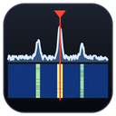

# TS-890S Desktop Front Panel

**Control your Kenwood TS-890S from your Windows PC or Mac. It has a TCI
server built in.**

[](https://github.com/lmacc/Kenwood-TS-890-Client-TCI-Server-v2/releases/latest)


[](https://www.paypal.com/donate/?business=9XVP453VRC5GC&no_recurring=0&item_name=Free%2C+and+always+will+be.+If+it%27s+earned+a+place+in+your+shack%2C+a+coffee+keeps+it+growing.+73%2C+Leslie+EI5GJB&currency_code=EUR)

<br clear="left">

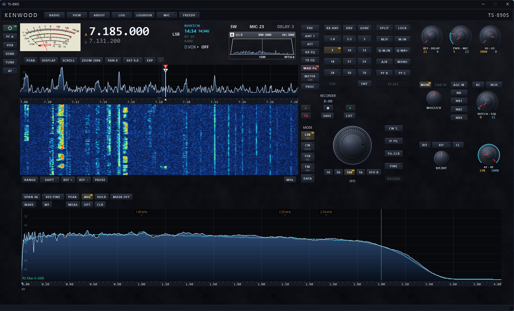

*The front panel as a new install opens it. Across the top: the analogue
S-meter, the frequency, the clock, RIT/XIT and D.VOX, then power, MIC and
DELAY over the filter scope. Below: the bandscope and waterfall, the
radio's own keys and knobs, and the audio scope along the bottom.*

The keys, knobs and meters look and work like the ones on the radio. You
can move, resize and hide the groups of controls, and save your own
layouts. CAT control and audio go over the radio's USB cable. The bandscope
comes over your network, because the USB serial link is too slow for a
smooth scope. Or connect over the network alone, and use the radio from
somewhere else.

## New in 2.3.0

- **[Remote operation](#remote-operation-experimental)** (experimental):
  use the radio from a laptop elsewhere, with the panel, bandscope and
  audio both ways. A small **Remote Relay** at home, on a PC or a
  Raspberry Pi, carries the radio's audio to you.
- **[Fits your screen](#fits-your-screen)**: on a laptop, the app draws
  itself smaller so the whole panel fits, with nothing overlapping.
- **A new Connections window**, with status lamps along the top and its
  settings in pages, and **View settings** for everything about how the
  app looks. VIEW itself is now a short menu.
- **Sharing CAT with a logger works better.** A program such as DXLab gets
  the answers to its own questions only, can start before the app does,
  and still follows the frequency while you tune.
- **Fixes:** BC now cycles OFF, BC 1, BC 2; REF + and REF − were the wrong
  way round; the Level out meter no longer freezes.

The full list is in the
[release notes](https://github.com/lmacc/Kenwood-TS-890-Client-TCI-Server-v2/releases/latest).

<details>
<summary><b>New in 2.2.2</b></summary>

- **[The top of the radio's screen](#the-top-of-the-screen)** on yours: an
  analogue S-meter with a moving needle, the filter scope, the clock, and
  the RIT/XIT, D.VOX, power and TCI readouts.
- **[Talk through the computer](#talk-through-the-computer)** with a
  headset or desk microphone.
- **[FreeDV digital voice](#freedv-digital-voice)**, with FreeDV Reporter
  built in.
- **[VST 3 plugins](#vst-3-plugins)** on your microphone and on what you
  hear.
- **[Band plans for 5 MHz and 70 MHz](#band-plans-for-5-mhz-and-70-mhz)**
  for Ireland, the UK and the US.
- **SHIFT** on the scope keys, a RIT/XIT knob that turns all the way round,
  **VIEW → Show hints**, and a new default layout.
- A **user guide** with a contents page, bookmarks and an index.

</details>

## What it does

- **The radio's front panel on your screen.** VFOs, band keys from 1.8 to
  70 MHz, modes, filters, split, TF-SET, RIT/XIT, AGC, NR, NB, notch, the
  meters and the radio's own menu. It all stays in step with the rig.
- **Remote operation** (experimental). Over the radio's own network port,
  from another room or another country, with your voice through the
  laptop's microphone.
- **Fits your screen**, from a big monitor down to a 13-inch laptop.
- **The top of the radio's screen.** Analogue or digital S-meter, filter
  scope, clock, RIT/XIT, D.VOX, power, MIC and DELAY.
- **Bandscope and waterfall** over your network. Click to tune, drag to
  tune, markers, drag the filter edges, and band plans for 5 and 70 MHz.
- **Audio scope.** See your receive and transmit audio, with peak and
  average traces, THD and S/N readings.
- **NR4 noise reduction** on the computer, on top of the radio's own NR.
- **CW, RTTY and PSK31.** Decode and send, with F1 to F8 macros.
- **Talk through the computer.** Plug a headset into the PC and hold MIC
  or F12 to talk. Your audio goes to the radio as it is, with no processing
  added.
- **FreeDV digital voice.** RADE, 700D, 700E and 1600, receive and
  transmit, with the other station's callsign on screen and FreeDV
  Reporter built in. No other program needed.
- **VST 3 plugins.** Your own equalisers, compressors and noise reducers
  on the microphone and on what you hear.
- **Logbook.** Log a QSO with two presses of the LOG key. It records their
  signal from the S-meter and sends the QSO to Log4OM, or any logger that
  takes QSOs from WSJT-X. If your logger is closed, the QSO waits and goes
  when the logger is running again.
- **FT8 with WSJT-X.** WSJT-X decodes show up on the bandscope, coloured
  if the country is new to you.
- **TCI server.** Log4OM, WSJT-X, MSHV and other programs can follow the
  radio over TCI. The panel shows which ones are connected.
- **CAT sharing (Windows only).** Share the radio's CAT port with another
  program, such as DXLab, through a virtual serial port, so both work at
  the same time.
- **Recorder**, **keyboard shortcuts** for every key, and a full
  [user guide](#the-user-guide).

| | |
|---|---|
| 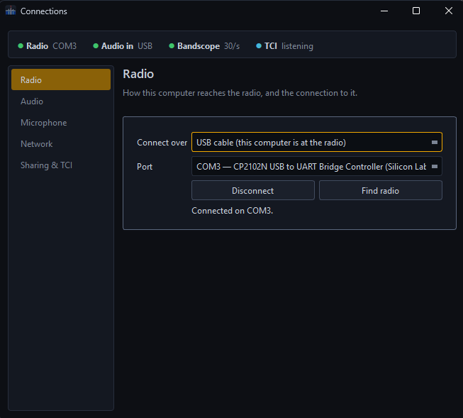 | 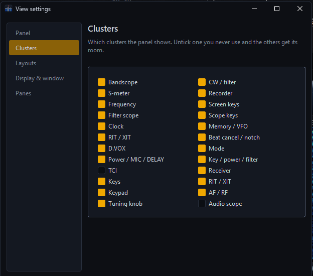 |
| All the setup in one window: a lamp for each link along the top, and pages for the radio, audio, microphone, network, and sharing and TCI. | View settings: the panel, its clusters, your layouts, the display size and the panes. |
|  |  |
| Log4OM and WSJT-X following the radio. | NR4 noise reduction, with every setting explained. |
|  | |
| Put any key on the keyboard. | |

## Remote operation (experimental)

Use your radio from somewhere else: a laptop in another room, or one at the
other end of the country. You get the same front panel, bandscope, meters
and audio as at home, and you talk through the laptop's microphone or
headset. Set **Connect over** in Connections to **Network**, and the radio's
own network port carries everything instead of the USB cable.

From outside your home, two more things are needed:

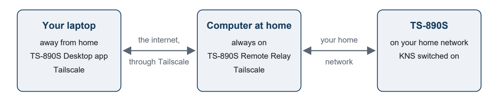

- **[Tailscale](https://tailscale.com)**, free, on the laptop and on a
  computer at home. It joins them over the internet as if they were on the
  same network, encrypted, with nothing opened on your home router.
- **The TS-890S Remote Relay**, a small program that comes with the app, on
  that computer at home. The radio only sends its audio to a computer on its
  own network, so the relay receives it there and passes it on to the
  laptop, with the laptop's transmit audio going the other way. Without it,
  control works from outside but there's no sound.

The relay lets the radio check your KNS login itself, serves one laptop at a
time, and frees the radio when you disconnect. **If the laptop's connection
drops while you're transmitting, the relay sends the radio to receive.**

The computer at home can be the shack PC, where the installer can start the
relay with Windows, or a **Raspberry Pi**, which uses a few watts and starts
the relay by itself at every boot. The user guide's chapter on remote
operation goes through it all step by step, including the delays to expect
and how to keep it safe. Try it into a dummy load first.

## Fits your screen

The app's layouts are arranged on a big monitor. On a smaller screen, such
as a laptop, which Windows usually also enlarges by 125 or 150 %, they
wouldn't fit. So the app fits itself:

- **On a new install**, it measures the screen and, if needed, draws itself
  smaller and restarts once. The whole panel opens in its arrangement, just
  smaller, with nothing overlapping or cut off.
- **On an existing install** moved to a smaller screen, it offers to.
- **Any time**: **VIEW → View settings → Display & window → Fit to this
  screen**, or choose a size by hand.

## The top of the screen

Across the top of the panel are the readouts the radio has across the top
of its own screen. Each one is a group of its own, so you can move it,
resize it or hide it, like any other part of the panel.

### The S-meter

The S-meter looks and moves like the analogue meter on the radio. While you
receive, the needle points at the same S-unit the radio does. It rises
quickly and falls back slowly, like a real meter. While you transmit, it
shows the meter you have chosen with the **METER** key.

**Double-click** the meter to change how it looks. The app remembers your
choice.

| Dark face | Light face | Digital meter |
|:---:|:---:|:---:|
| 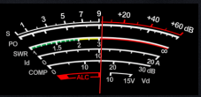 | 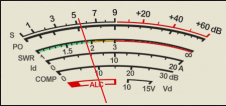 | 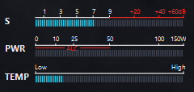 |
| White scales on black. | Black scales on cream, like the radio's white meter. | Bars for S, PWR and the meter chosen with METER, here TEMP. |

- **On the analogue faces**, the top scale is S1 to S9, then +20, +40 and
  +60 dB in red. The scales below it are for transmitting: PO (power), SWR,
  Id (current), COMP, ALC and Vd (voltage).
- **On the digital meter**, each bar fills from the left. S is the signal
  you are receiving. PWR is your power while you transmit, 0 to 150 W. The
  third bar is the meter chosen with METER.

### The METER key

**METER** chooses which meter shows while you transmit. Each press goes to
the next one: PO, ALC, SWR, COMP, Id, Vd, then TEMP. The one chosen shows
on the key.

- **COMP** is only offered while the speech processor (PROC) is on, as on
  the radio.
- **TEMP** is the radio's temperature. It puts the meter on its digital
  look, with a TEMP bar from Low to High.
- METER here and METER on the radio are the same setting. Press either and
  the other follows.

### The filter scope

The small scope at the top right is a copy of the filter scope on the
radio. It shows which receive filter is in use (A, B or C), its settings
(low cut, bandwidth and high cut, or width and shift), the filter's shape,
the audio inside it, and the roofing filter. For voice it has a 3 kHz
scale, and a 5 kHz scale once the high cut goes above 3 kHz, as the radio
does.

### The clock

The clock shows the radio's own date and time, and its second clock (UTC,
for example). **Double-click** it to open the **Radio clock** window, where
you can:

- set the radio to this computer's time with one click, or type a time in;
- have the radio set itself from a time server (NTP);
- choose the time zones, the date format, and which clocks the radio shows
  on its own screen.

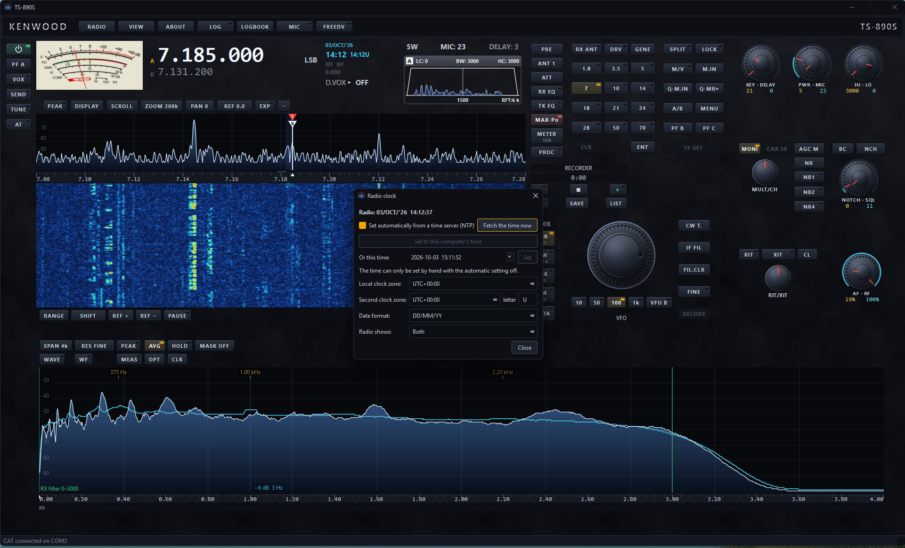

*The Radio clock window. Here the radio is setting its own time from a time
server, so setting it by hand is greyed out.*

### The other readouts

| Readout | What it shows |
|---|---|
| **Frequency** | VFO A and VFO B, the mode, and SPLIT, RIT, XIT and LOCK when they are on. Now a group of its own, so you can move it. |
| **RIT / XIT** | Whether RIT and XIT are on, and the offset: 0.000 when there is none. |
| **D.VOX** | Whether DATA VOX is on, and which input it listens to. |
| **Power / MIC / DELAY** | Your transmit power, microphone gain and delay, for example "5W MIC: 23 DELAY: 3". |
| **TCI** | Which programs are connected to the TCI server, as short tags: **L4OM** for Log4OM, **WSJT** for WSJT-X, **N1MM**, **JTDX**, and so on. If there are more than fit, it shows "+2" and so on. Rest the pointer on it for the full list. |

## Talk through the computer

Plug a headset or desk microphone into the PC, and talk on the air through
the app.

1. Open **RADIO → Connections**. In the **Microphone** box, tick **Mic in**
   and pick your microphone.
2. Talk, and watch **Level**. Aim for peaks around −12 dB. Use **Trim** if
   it doesn't get there.
3. Hold **MIC** on the top bar, or hold **F12**, and talk. Let go to go
   back to receive.

Tick **MIC key latches** if you'd rather click once to talk and again to
stop. The app adds no processing of its own. Shape your sound with the
radio's TX EQ, or with [plugins](#vst-3-plugins), and check it on the audio
scope. For safety, the microphone never transmits for more than three
minutes at a time.

## FreeDV digital voice

FreeDV is built in. Press **FREEDV** and the FreeDV pane opens under the
waterfall. **RADIO → Set up for FreeDV** puts the radio in USB-D (or
LSB-D, where stations work LSB) with the right filters, in one press you
can undo. When a station comes on you hear their voice without the hiss,
and their callsign shows in the pane. Hold **MIC** or **F12** to answer.
Your voice goes out as FreeDV, with your callsign.

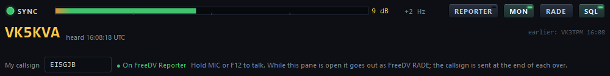

*The FreeDV pane in RADE: locked on to a signal 9 dB above the noise, with
the callsign of the station being heard.*

- **All the current modes.** RADE, which is what most FreeDV stations use
  now, and 700D, 700E and 1600. It works with the FreeDV application and
  anyone else running FreeDV.
- **FreeDV Reporter.** The **REPORTER** key shows every FreeDV station on
  the air, where they are, who is transmitting and who has heard whom.
  Double-click one to tune to it. You can put your own station on the list
  too, but only if you tick the box. Until then nothing about you is sent.
- **No extra setup.** It uses the same audio as the rest of the app. If
  your microphone works, FreeDV works.

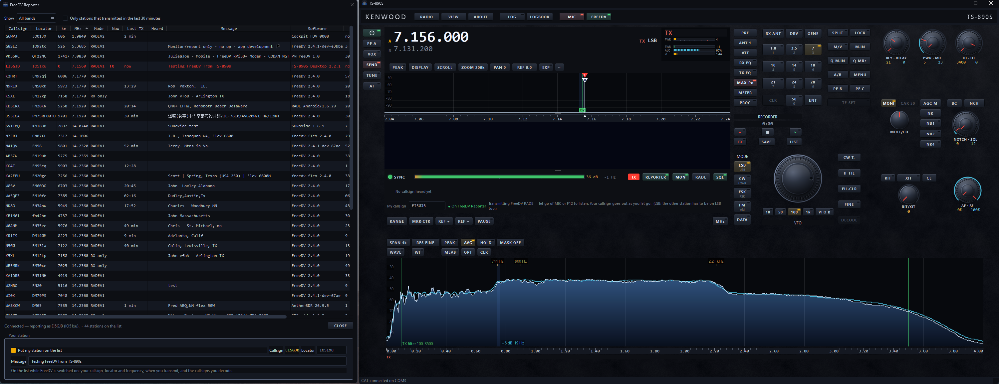

*FreeDV Reporter beside the front panel. EI5GJB is on the list and
transmitting in RADE on 7.156 MHz, so its line is red.*

## VST 3 plugins

Run the same equalisers, compressors, de-essers and noise reducers a
recording studio uses. There are two chains, each with its own window:

- **Microphone**: your voice, before it goes to the radio (and before
  FreeDV, when FreeDV is on).
- **Listen**: the radio's audio you hear on this computer, and FreeDV's
  decoded voice. The decoders, the audio scope, recordings and TCI still
  get the radio's audio as it arrives.

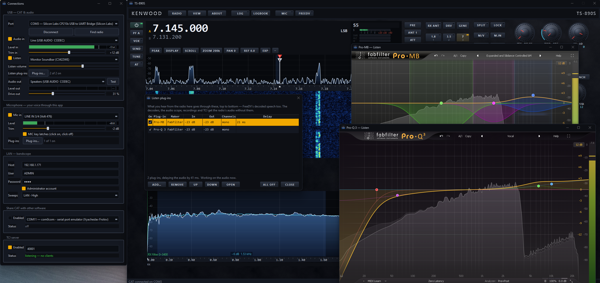

*Two Listen plugins working on the receive audio, with their own windows
open. In Connections, on the left, each chain says how many plugins it has
and how many are on.*

Open a chain with the **Plugins…** button in **RADIO → Connections**, or
from the RADIO menu. **ADD…** lists every VST 3 plugin on your computer.
Each plugin can be switched on and off, moved up or down, and opened to set
it up. **ALL OFF** lets you hear the difference they make. Every setting is
kept for next time.

| | |
|---|---|
| 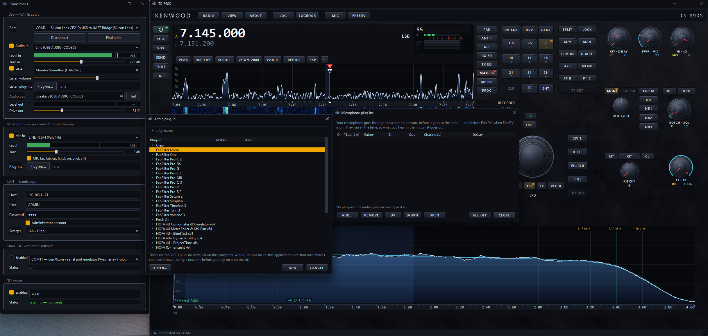 | 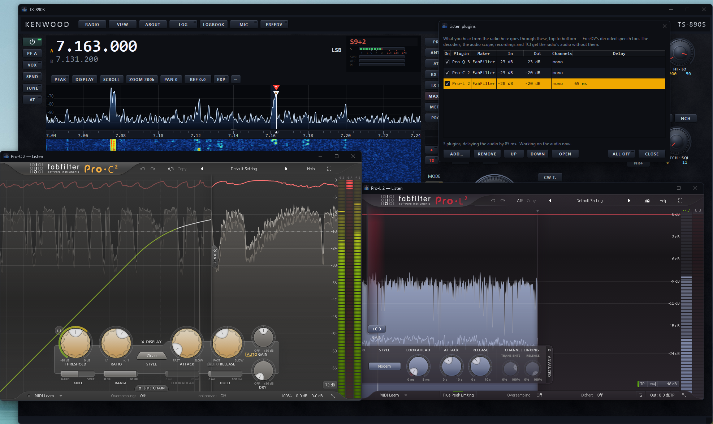 |
| Adding a plugin to the microphone chain. | A Listen chain of three plugins, with the level in and out of each, and how much they delay the audio. |

The plugins run in a separate program in the background. A plugin that
crashes or stops responding can't take the front panel with it, or leave
the radio stuck in transmit. Your audio carries on without it, and the app
tells you which plugin it was. Plugins have been tried on Windows so far.

## Band plans for 5 MHz and 70 MHz

Choose your country under **RADIO → Band plan**: Ireland, the UK or the
US. On 5 MHz and 70 MHz the bandscope shows the segments you may use, in
colour, with the details when you rest the pointer on one. Anything
outside the plan is tinted red. If what you are about to transmit falls
outside the plan, or is too wide for that part of it, a short warning
appears. It only warns. It never stops you transmitting.

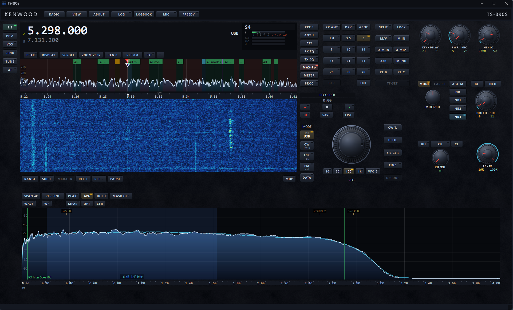

*60 m with the band plan on: the allowed segments are marked along the top
of the bandscope.*

- **UK**: the RSGB 5 MHz plan from 1 January 2026.
- **Ireland**: the RSGB blocks, with the IRTS (IARU Region 1) plan from
  5351.5 to 5366.5 kHz.
- **US**: the FCC rules.
- On 5 MHz the radio's transmit and receive filters are set to the band's
  width (2.7 kHz in Ireland and the UK, 2.8 kHz in the US). Your own
  filters are put back when you leave the band.
- The band keys now include **5** and **70**.

## Log4OM over TCI

Log4OM can follow the radio through the app's TCI server. In Log4OM, open
the configuration, go to **Hardware Configuration → CAT interface**, and
set **CAT Engine** to **TCIProtocol**. On the **TCI** tab, set the address
to **localhost** and the port to the one shown in the app's Connections
window (40001 here).

| | |
|---|---|
| 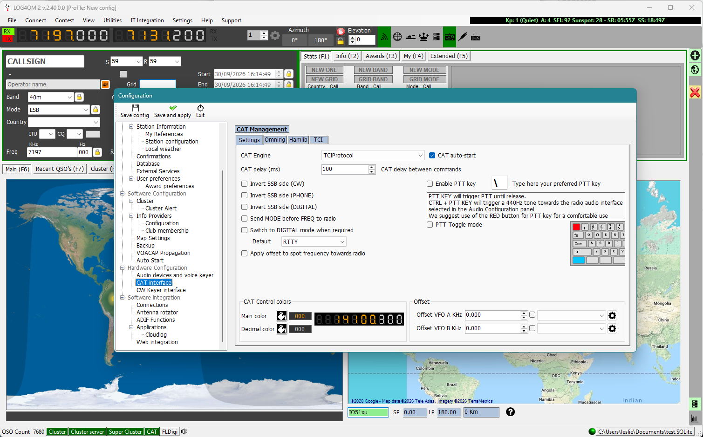 | 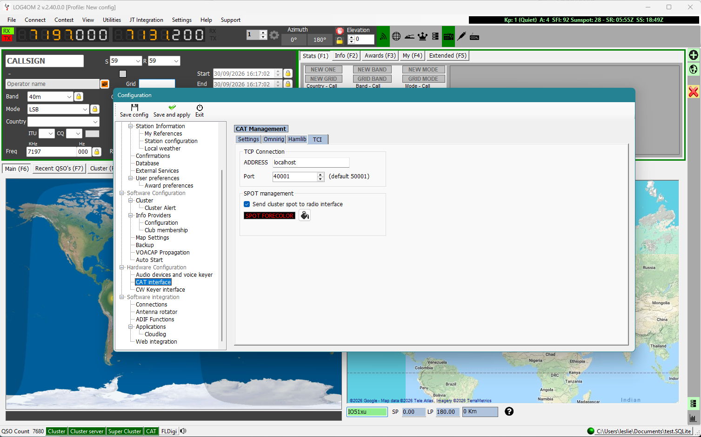 |
| CAT Engine set to TCIProtocol. | The TCI tab: localhost and the app's port. |

> **Log4OM doesn't reconnect by itself.** If you close and restart the
> app, start Log4OM's CAT again with **Connect → CAT → Start CAT**. Other
> programs, such as WSJT-X, reconnect on their own.

## Logging from the decoded text

In CW, RTTY and PSK31 you can take the other station's details straight
from the decoded text. Double-click a callsign and a menu asks what it is.
Pick **Use as the DX callsign** and it goes into the Call box, ready for
your macros. You can also pick their **report, name, QTH or locator**, and
it goes into the QSO you are logging.

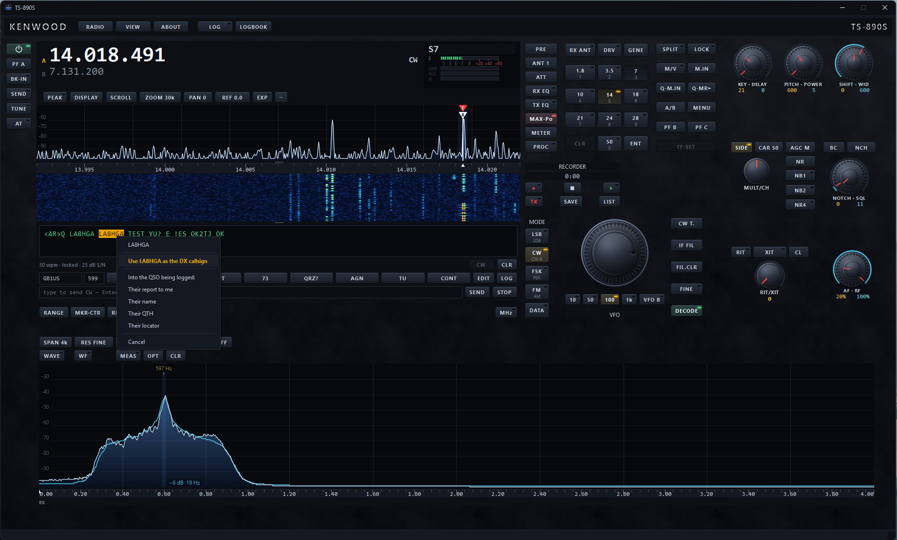

*CW on 20m at 30 wpm. LA8HGA has been double-clicked and the menu is
offering to make it the DX callsign. Under the text are the Call and RST
boxes, the F1 to F8 macro keys, EDIT and LOG.*

Then press **LOG**. You'll find it on the top bar and beside the macros,
or use Ctrl+L.

- **First press:** the QSO opens with the frequency, band, mode, time and
  their S-meter reading already filled in. In CW, RTTY and PSK31 the call
  and your report come from the decode pane.
- **Second press:** the QSO is saved.
- **In SSB** you type the call, and your report is taken from the S-meter.
  S7 gives 57.

Every QSO is kept in the app's own logbook and sent on to your logging
program in the same way WSJT-X sends its QSOs. For Log4OM there is nothing
to set up. If Log4OM is not running, the QSO waits until it is. The app
also checks Log4OM's logbook, and marks the QSO as done only when it is
really in there.

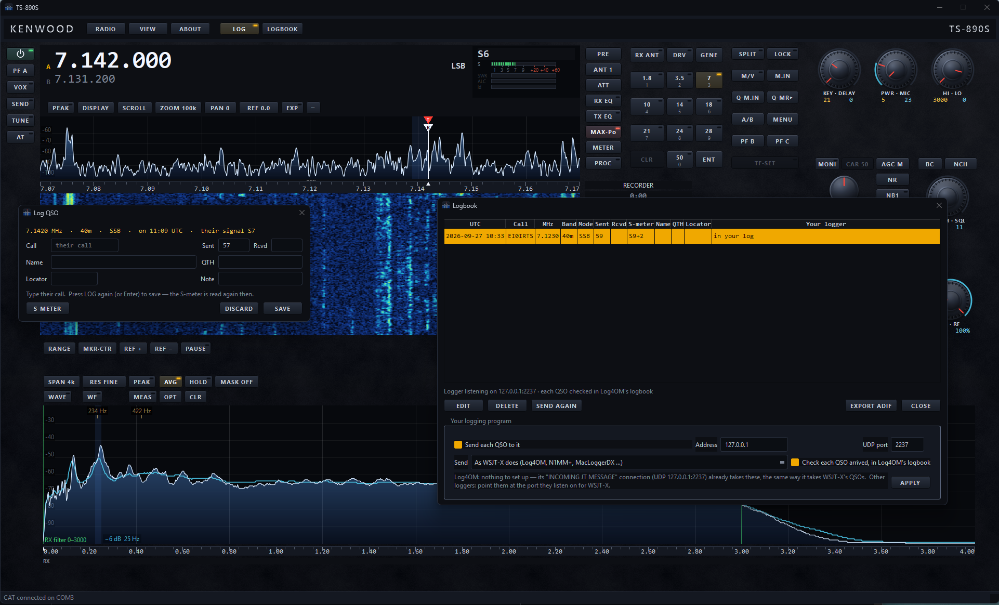

*Left: logging a QSO on 40m. Their S7 signal has already been turned into
a 57 report. Right: the Logbook. The earlier QSO says "in your log", which
means Log4OM has it.*

## Download and install

### Windows

1. Go to the
   [latest release](https://github.com/lmacc/Kenwood-TS-890-Client-TCI-Server-v2/releases/latest)
   and download **`TS-890S-Desktop-<version>-setup.exe`**.
2. Run it. It installs just for you and doesn't need an administrator. On
   its first page you can choose to install it for everyone on the computer
   instead.
3. Start **TS-890S Desktop** from the Start menu. The user guide is there
   too.

> **"Windows protected your PC"?** The installer isn't digitally signed
> yet, so Windows asks before running it the first time. Click **More
> info**, then **Run anyway**.

The first time you run it, the Connections window opens and the app looks
for the radio's COM port by itself. Then, on the **Network** page, set the
radio's IP address for the bandscope, and on the **Audio** page tick
**Audio in**.

On the installer's tasks page there's also a tick box to **start the TS-890S
Remote Relay with Windows**. Only tick it on the computer at the radio, and
only if you'll operate from outside your home. It's off by default.

> **No frequency showing?** The radio has two COM ports and only one of
> them works for control. Press **Find radio** in **RADIO → Connections**
> and the app picks the right one. It also tells you if another program is
> using the port, or if the radio's CAT speed (menu 7-00) isn't 115200.

A newer installer updates the one you have, and your settings are kept. To
remove it, use **Settings → Apps** like any other program.

**Don't want to install it?** Each release also has a portable
**`…-win64.zip`**. Right-click it and choose **Extract All** first, then run
`ts890-usb.exe` from the folder you extracted. If you run it from inside the
zip it can't find its files and stops with *"Qt6Core.dll was not found"*.

### Mac (new in 2.2.0)

The Mac version is new. It is built and checked the same way as the Windows
version, but it hasn't been tried on many Macs yet. If you use it, please
let me know how it goes, good or bad, in
[Issues](https://github.com/lmacc/Kenwood-TS-890-Client-TCI-Server-v2/issues).

1. Go to the
   [latest release](https://github.com/lmacc/Kenwood-TS-890-Client-TCI-Server-v2/releases/latest)
   and download **`TS-890S-Desktop-<version>-macos.dmg`**.
2. Open it and drag **TS-890S Desktop** into the **Applications** folder.
3. Open it from Applications.

> **"Apple could not verify…"?** The app isn't signed by Apple yet, so the
> Mac asks before opening it the first time.
> On **macOS 15 or later**: try to open it once and click **Done**. Then go
> to **System Settings → Privacy & Security**, scroll down and click **Open
> Anyway**.
> On **macOS 13 or 14**: hold Control and click the app in Applications,
> choose **Open**, then **Open** again.
> You only have to do this once.

The Mac will then ask if the app can use the **microphone**. Say yes. That's
how it hears the radio's USB audio. Without it the scopes and decoders get
no sound. It may also ask about the **local network**. That's for the
bandscope, so say yes to that too.

The first time you run it, the Connections window opens and the app looks
for the radio's port by itself. The radio's USB ports show up with names
like `cu.SLAB_USBtoUART` or `cu.usbserial-…`. If it picks the wrong one,
press **Find radio**. To update later, drag the new version over the old
one. Your settings are kept.

### Raspberry Pi, for the Remote Relay (new in 2.3.0)

Only needed for [remote operation](#remote-operation-experimental), if you'd
rather leave a Raspberry Pi on at home than a PC. It runs the relay, not the
app.

1. From the
   [latest release](https://github.com/lmacc/Kenwood-TS-890-Client-TCI-Server-v2/releases/latest),
   download **`TS-890S-Remote-Relay-raspberry-pi.tar.gz`** and copy it to
   the Pi.
2. On the Pi, using your radio's address in the last line:
   ```
   tar xzf TS-890S-Remote-Relay-raspberry-pi.tar.gz
   cd ts890-remote-relay
   sudo sh install.sh 192.168.1.171
   ```
3. It starts at once, and at every boot. The last lines show the Pi's
   Tailscale address, which goes in **Host** on the laptop.

Needs a Raspberry Pi 2 or later (including the Pi Zero 2 W) with Raspberry
Pi OS, 32-bit or 64-bit, and Tailscale. The README in the package and the
user guide have the commands for stopping, starting and reading its log.

### What it runs on

| | Windows | Mac |
|---|---|---|
| **System** | Windows 10 or 11, 64-bit | macOS 13 Ventura or later (13, 14 Sonoma, 15 Sequoia, 26 Tahoe) |
| **Computer** | Any 64-bit PC | Apple silicon Macs (M1, M2, M3, M4 and newer) and Intel Macs. One download works on both. |
| **Download** | `…-setup.exe`, or the portable `…-win64.zip` | `…-macos.dmg` |
| **Won't run on** | Windows 7 or 8, or 32-bit Windows | macOS 12 or older. That includes older Intel Macs that can't update past macOS 12. |

You also need:

- The USB cable from the radio to the computer, and the radio's USB driver
  (Silicon Labs CP210x) so its ports show up. On a Mac, if the ports don't
  appear, install the CP210x driver for macOS from Silicon Labs.
- The radio's CAT speed set to **115200** (menu 7-00).
- For the bandscope over the network: the radio on your network, and the
  KNS user name and password set on the radio. Everything else works
  without it, just with a slower bandscope over USB.
- For remote operation: no USB cable on the laptop. The radio on your home
  network with its KNS and built-in VoIP switched on and, from outside your
  home, Tailscale and the Remote Relay. See
  [Remote operation](#remote-operation-experimental).

On a Mac there's no CAT sharing. Use the TCI server to connect other
programs instead. The logbook works with Mac loggers that take QSOs from
WSJT-X, such as MacLoggerDX and RUMlogNG.

## The user guide

The download comes with a full user guide, written for someone who has
never used the app before. You can open it any time from **ABOUT → USER
GUIDE**. It has a contents page, bookmarks in your PDF reader's side panel,
and an index at the back, so you can go straight to what you need. Some of
what it covers:

- **Setup in one window.** COM port, audio, microphone, bandscope and
  sharing are all in the Connections window, which opens by itself the
  first time, with a lamp for each link and a page for each subject. **Find
  radio** picks the right COM port for you. If the bandscope is ever empty,
  it tells you why.
- **Remote operation.** How it works and why the Remote Relay is needed,
  what you need at home and away, setting it up step by step on a PC or a
  Raspberry Pi, the commands for running the relay, the delays to expect,
  and keeping it safe.
- **The top of the screen.** The S-meter and its three looks, the METER
  key, the filter scope, setting the clock, and the TCI readout.
- **Tuning.** Drag the knob, use the mouse wheel (hold Shift for small
  steps), click or drag on the bandscope, Ctrl+wheel to change the span, or
  type a frequency on the keypad.
- **Band stacks that remember the mode.** Hold a band key for five memories
  per band. Each one keeps the frequency and the mode you were using.
- **Split.** TF-SET lets you listen on your transmit frequency and move it.
  A marker shows where you came from. The VFO B key moves your transmit
  frequency while you keep listening to the pile-up.
- **Bandscope settings.** Pull the trace down so strong signals don't hit
  the top. Pause it, change the reference level, pick colours, and use
  SHIFT. It remembers all your choices.
- **Band plans.** What each 5 MHz and 70 MHz segment is for, in Ireland,
  the UK and the US, and where each figure comes from.
- **Your own audio.** The audio scope shows what your transmit audio looks
  like, with THD and S/N readings, before-and-after comparisons, and masks
  for 2.8k, 3.5k and 4k eSSB widths.
- **NR4.** Noise reduction on the computer, on top of the radio's own NR.
  The scopes and the recorder still get the audio as the radio sent it.
- **FT8.** WSJT-X decodes show on the bandscope where they were heard.
  Amber is a new country, cyan is new on this band, and an **L** means they
  use LoTW. **Set up for FT8** sets the radio up in one press, and **Put it
  back** undoes it.
- **Microphone and FreeDV.** Setting the microphone level, what each
  FreeDV mode is for, setting the radio up for it, the FreeDV pane, and
  FreeDV Reporter.
- **Plugins.** Adding them, putting them in order, what the delay means,
  and what happens if one misbehaves.
- **Logging.** How to pick details out of the decoded text, the LOG key,
  the Logbook, and connecting it to your logger.
- **The radio's menu.** Every setting shows the radio's own menu number, and
  you can search it. Type *115200* and it finds the baud rate.
- **Make it yours.** Move, resize and hide the groups of controls, save
  layouts, fit the app to your screen, lock the window size, turn hints off,
  and put any key on the keyboard. View settings has it all in one place.
- **Troubleshooting.** A table that goes from the problem to the most
  likely cause.

## Support

It's free and it always will be. If it's earned a place in your shack, a
coffee keeps it going. There's a **DONATE** key in the app's About box, or
use the button below.


[](https://www.paypal.com/donate/?business=9XVP453VRC5GC&no_recurring=0&item_name=Free%2C+and+always+will+be.+If+it%27s+earned+a+place+in+your+shack%2C+a+coffee+keeps+it+growing.+73%2C+Leslie+EI5GJB&currency_code=EUR)

73, Leslie EI5GJB

## Licence

Freeware. It's free to use and free to pass on as long as you don't change
it, but it's not for sale. See [LICENSE](LICENSE). Only the finished program
is released, not the source code.

It uses Qt, libspecbleach, codec2, RADE, Opus, the VST 3 SDK and KISS FFT,
which each have their own licence. You'll find those in the `licenses`
folder of the download. The source of libspecbleach and codec2, as used, is
attached to each release.

VST is a registered trademark of Steinberg Media Technologies GmbH. This
app is not made or endorsed by JVCKENWOOD. TS-890S and KENWOOD are
trademarks of JVCKENWOOD Corporation.
