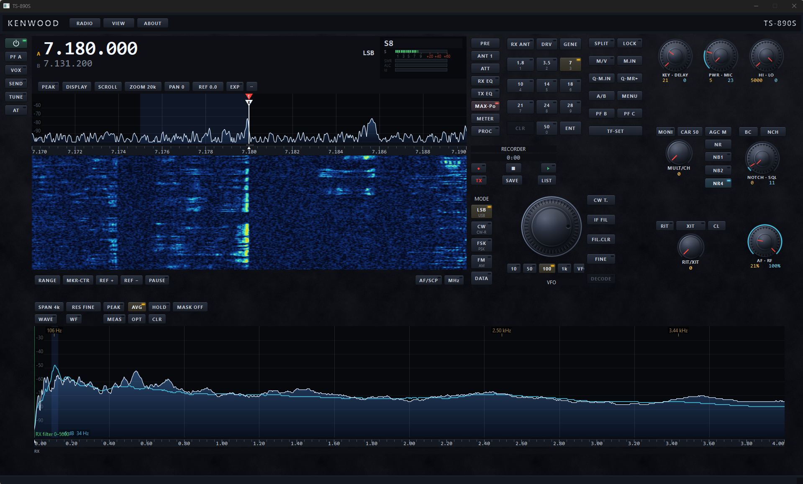
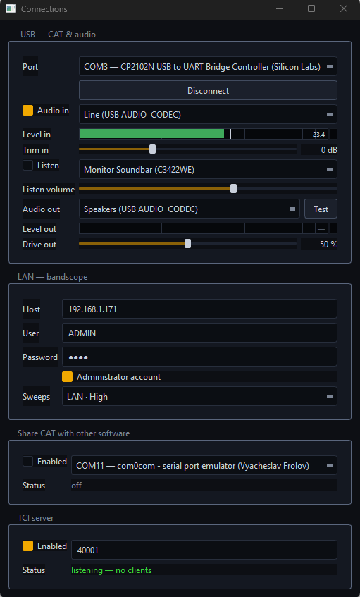
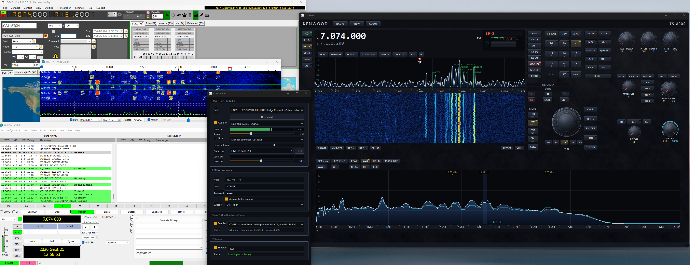
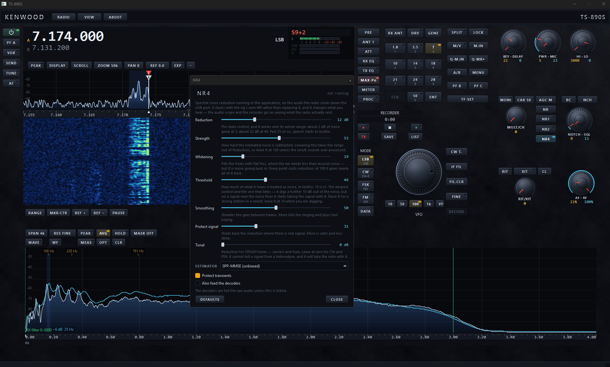
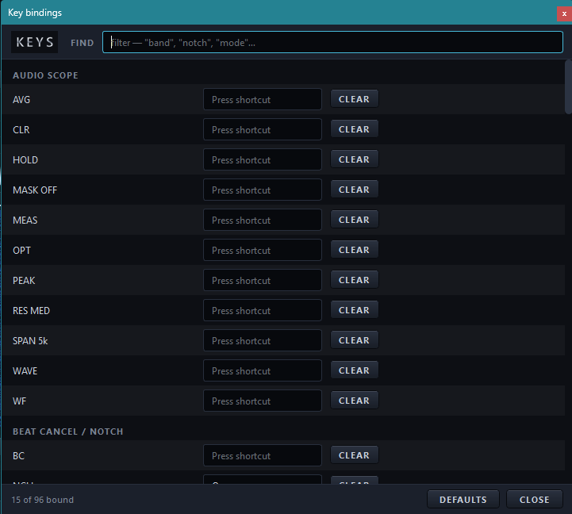
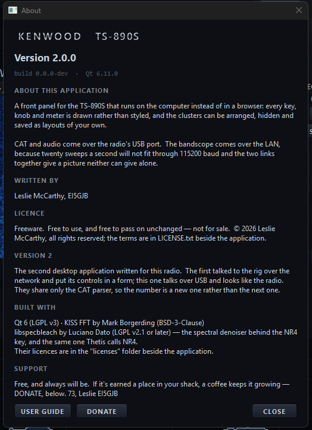

# TS-890S Desktop Front Panel

**A front panel for the Kenwood TS-890S on your Windows PC — with a TCI server
built in.**

Every key, knob and meter is drawn to look and behave like the radio's own,
and the clusters of controls can be moved, resized, hidden and saved as
layouts of your own. CAT and audio come over the radio's USB cable; the
bandscope comes over your network, fast and smooth, because twenty sweeps a
second will not fit down a 115200-baud serial port.

## What it does

- **The radio's front panel on screen** — VFOs, band keys, modes, filters,
  split and TF-SET, RIT/XIT, AGC, NR, NB, notch, the meters, the radio's own
  menu, and more, all live and in step with the rig.
- **Bandscope and waterfall** over the LAN, with markers, passband dragging
  and click-to-tune.
- **Audio scope** — a measuring analyser for the receive and transmit audio:
  peak and average traces, holds to compare against, THD and S/N readings.
- **NR4** — spectral noise reduction on the computer, on top of the radio's
  own NR.
- **CW, RTTY and PSK31** — decode and send.
- **FT8 alongside WSJT-X** — decodes shown on the bandscope, coloured by what
  is new to you.
- **TCI server** — logging and digital-mode programs such as Log4OM, WSJT-X
  and MSHV follow the radio over TCI.
- **CAT sharing** — pass CAT through to another program on a virtual serial
  port, so the panel and your logger both work at once.
- **Recorder**, **keyboard shortcuts** for every key, and a full
  [user guide](#the-user-guide).

| | |
|---|---|
|  |  |
| One window to set up: COM port, audio, bandscope, sharing. | Log4OM and WSJT-X following the radio while the panel runs. |
|  |  |
| NR4 noise reduction, with every control explained. | Put any key on the keyboard. |

## Download and run

1. Download the zip from the
   [latest release](https://github.com/lmacc/Kenwood-TS-890-Client-TCI-Server-v2/releases/latest).
2. Unzip it anywhere — the Desktop, Documents, a USB stick.
3. Run `ts890-usb.exe`.

There is no installer. On the first run the Connections window opens by
itself: set the radio's COM port, its IP address for the bandscope, and tick
**Audio in**.

**You need:**

- Windows 10 or 11, 64-bit.
- The radio's USB cable to the PC, with its USB driver (Silicon Labs CP210x)
  installed so its COM ports appear.
- The radio's CAT speed at **115200** (menu 7-00).
- For the LAN bandscope: the radio on your network and its KNS user name and
  password. Without it everything else still works, with a slower bandscope
  over USB.

## The user guide

A full guide comes with the download, written for somebody who has never
used the application before. Open it any time from **ABOUT → USER GUIDE**.
A taste of what's in it:

- **Up and running in one window.** COM port, audio, bandscope and sharing
  are all set in one place, and it opens by itself the first time you run
  the app. If the bandscope is ever empty, the scope itself tells you why.
- **Tune the way you like.** Drag the knob, roll the mouse wheel (Shift for
  fine steps), click or drag on the bandscope, Ctrl+wheel to zoom the span,
  or type a frequency on the keypad.
- **Band stacks that remember the mode.** Press and hold a band key for five
  slots per band, each keeping its frequency *and* the mode you worked it in,
  because 7.040 in CW and 7.040 in LSB are different places.
- **Work split without losing your place.** TF-SET lets you listen on your
  transmit frequency and move it. The R and T markers merge on the scope, and
  a marker is left where you came from. A red VFO B key moves your transmit
  frequency while the receiver stays on the pile-up.
- **A bandscope you can tame.** Drag the trace down and strong signals stop
  hitting the top while the noise floor stays put. Pause the picture, nudge
  the reference, pick a palette, and every choice is remembered.
- **See your own audio.** Nothing on the radio shows you what your audio
  looks like. The audio scope does: average and peak traces, THD, THD+N and
  S/N readings from a click on a peak, before-and-after holds to compare, and
  masks for 2.8k, 3.5k and 4k eSSB bandwidths.
- **NR4 on the PC.** Spectral noise reduction on what you hear, stacking with
  the radio's own NR, while the scopes and the recorder keep what the radio
  really sent.
- **FT8 with the band at a glance.** WSJT-X decodes land on the bandscope at
  the frequency they were heard: amber for a DXCC entity you've never worked,
  cyan for new on this band, and an **L** for LoTW users. **Set up for FT8**
  configures the rig in one press, and **Put it back** undoes exactly what it
  changed.
- **The radio's menu, searchable.** Every row carries the rig's own menu
  number, and typing *115200* finds the baud rate. The network (KNS) settings
  have a page of their own.
- **Make it yours.** Arrange, resize and hide the clusters, save layouts (a
  contest one and a listening one), lock the window size, and put any key on
  the keyboard.
- **When something isn't working.** A troubleshooting table goes straight
  from the symptom to the most likely cause.

## Support

Free, and always will be. If it's earned a place in your shack, a coffee
keeps it growing. There's a **DONATE** key in the application's About box,
or use the button below.

73, Leslie EI5GJB

## Licence

Freeware — free to use, and free to pass on unchanged, but not for sale. See
[LICENSE](LICENSE). The application is distributed as a compiled program
only.

It is built on Qt, libspecbleach and KISS FFT, each under its own licence;
the notices are in the `licenses` folder of the download. The source of
libspecbleach, as built, is attached to each release.

Not made or endorsed by JVCKENWOOD. TS-890S and KENWOOD are trademarks of
JVCKENWOOD Corporation.
